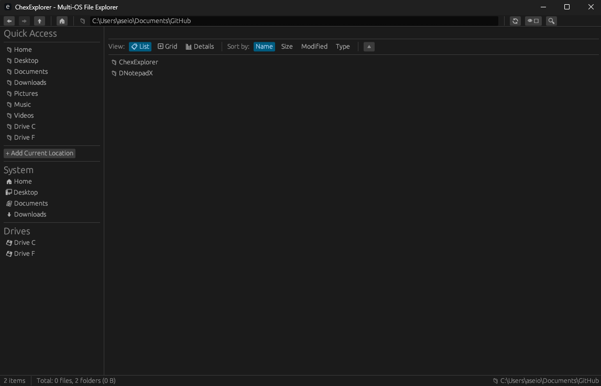

# ChexExplorer - Multi-OS File Explorer

A robust, modern file explorer built with Rust that rivals Windows File Explorer in functionality while providing excellent cross-platform support for Windows, macOS, and Linux.



## 🚀 Features

### Core File Management
- **Multi-platform support** - Works seamlessly on Windows, macOS, and Linux
- **Fast file browsing** - Efficient directory navigation with async I/O
- **Multiple view modes** - List, Grid, and Details views
- **Real-time updates** - File system watching for automatic refresh
- **Keyboard shortcuts** - Full keyboard navigation support

### Advanced Operations
- **File operations** - Copy, move, delete, rename with progress tracking
- **Archive support** - Create and extract ZIP/TAR archives
- **Search functionality** - Powerful file search with filters
- **Thumbnail generation** - Image previews and thumbnails
- **Bookmarks** - Quick access to frequently used locations
- **Tab support** - Multi-tab interface for better workflow

### User Experience
- **Modern UI** - Clean, responsive interface built with egui
- **Customizable** - Adjustable view options and preferences
- **Safe operations** - Trash/recycle bin support, confirmation dialogs
- **Performance** - Optimized for large directories and file operations

## 🛠️ Technology Stack

- **Language**: Rust 🦀
- **GUI Framework**: egui/eframe
- **Async Runtime**: Tokio
- **File Operations**: Native Rust with cross-platform compatibility
- **Image Processing**: image crate for thumbnails
- **Archive Support**: zip and tar crates

## 📋 Requirements

- Rust 1.70 or later
- Operating System: Windows 10+, macOS 10.14+, or Linux with GTK

## 🚀 Quick Start

### Installation

1. **Clone the repository**:
   ```bash
   git clone https://github.com/your-username/chex-explorer.git
   cd chex-explorer
   ```

2. **Build and run**:
   ```bash
   cargo run
   ```

3. **Build for release** (Windows GUI without terminal):
   ```bash
   cargo build --release
   ```
   
   The release build is optimized and configured to run as a Windows GUI application without showing a console window.

### Development Setup

1. **Install Rust** (if not already installed):
   ```bash
   curl --proto '=https' --tlsv1.2 -sSf https://sh.rustup.rs | sh
   ```

2. **Install development dependencies**:
   ```bash
   # On Ubuntu/Debian
   sudo apt-get install build-essential pkg-config libgtk-3-dev

   # On macOS (using Homebrew)
   brew install pkg-config

   # On Windows
   # No additional dependencies required
   ```

## 🎯 Usage

### Basic Navigation
- **Navigate directories**: Double-click folders or use the address bar
- **Go back/forward**: Use navigation buttons or Alt+Left/Right
- **Go up**: Click the up button or press Alt+Up
- **Refresh**: Press F5 or click the refresh button

### File Operations
- **Select files**: Click to select, Ctrl+Click for multiple selection
- **Copy/Cut/Paste**: Use standard Ctrl+C/X/V shortcuts
- **Delete**: Press Delete key or use context menu
- **Rename**: Right-click and select rename or press F2

### View Options
- **Change view mode**: Use the toolbar buttons (List/Grid/Details)
- **Sort files**: Click column headers in Details view
- **Show hidden files**: Press Ctrl+H or use the toggle button

### Advanced Features
- **Search**: Use Ctrl+F to open search dialog
- **Bookmarks**: Add current location to bookmarks for quick access
- **Archives**: Right-click to create archives or extract existing ones

## 🔧 Configuration

The application stores its configuration in:
- **Windows**: `%APPDATA%\chex-explorer\`
- **macOS**: `~/Library/Application Support/chex-explorer/`
- **Linux**: `~/.config/chex-explorer/`

Configuration includes:
- Window size and position
- View preferences
- Bookmarks
- Recent locations
- Theme settings

## 🎨 Themes and Customization

ChexExplorer supports:
- Dark and light themes
- Customizable font sizes
- Adjustable thumbnail sizes
- Configurable keyboard shortcuts

## 🚀 Performance

Optimized for:
- **Large directories** - Efficient loading and rendering
- **File operations** - Progress tracking and cancellation
- **Memory usage** - Minimal memory footprint
- **Startup time** - Fast application launch

## 🛡️ Safety Features

- **Trash support** - Files are moved to trash/recycle bin by default
- **Confirmation dialogs** - For destructive operations
- **Error handling** - Graceful error recovery
- **Data integrity** - Safe file operations with rollback support

## 🤝 Contributing

We welcome contributions! Please see our [Contributing Guidelines](CONTRIBUTING.md) for details.

### Development Workflow

1. Fork the repository
2. Create a feature branch: `git checkout -b feature/new-feature`
3. Make your changes and add tests
4. Run tests: `cargo test`
5. Submit a pull request

### Code Style

- Follow Rust standard formatting: `cargo fmt`
- Run clippy for linting: `cargo clippy`
- Ensure all tests pass: `cargo test`

## 📝 License

This project is licensed under the MIT License - see the [LICENSE](LICENSE) file for details.

## 🙏 Acknowledgments

- [egui](https://github.com/emilk/egui) - Excellent immediate mode GUI framework
- [Rust community](https://www.rust-lang.org/community) - For the amazing ecosystem
- File manager inspirations: Windows Explorer, macOS Finder, Nautilus

## 📞 Support

- **Issues**: Report bugs and request features on [GitHub Issues](https://github.com/your-username/chex-explorer/issues)
- **Discussions**: Join conversations on [GitHub Discussions](https://github.com/your-username/chex-explorer/discussions)
- **Documentation**: Check the [Wiki](https://github.com/your-username/chex-explorer/wiki) for detailed documentation

## 🗺️ Roadmap

### Upcoming Features
- [ ] Plugin system for extensibility
- [ ] Cloud storage integration (Google Drive, OneDrive, Dropbox)
- [ ] Advanced file preview (PDF, video thumbnails)
- [ ] Batch file operations
- [ ] Network location support
- [ ] File comparison tools
- [ ] Advanced search with content indexing

### Performance Improvements
- [ ] Virtual scrolling for huge directories
- [ ] Background thumbnail generation
- [ ] Incremental search
- [ ] Cached directory metadata

---

Built with ❤️ in Rust 🦀
